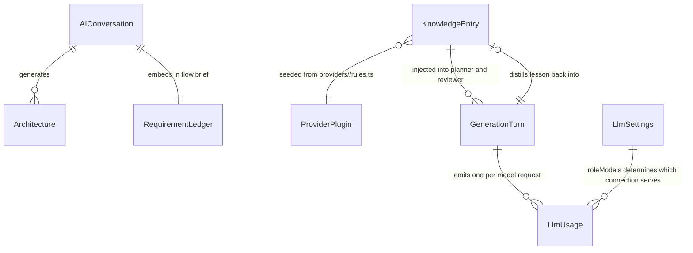

# Phase 1 Data Model: Multi-Agent Generation with Conversation Memory, Knowledge Store & Model Tiering

**Feature**: `008-multi-agent-knowledge-pipeline` | **Date**: 2026-07-31 | **Plan**: [plan.md](./plan.md)

MongoDB via Mongoose remains the sole system of record. This feature adds **2 collections**, extends **2 existing collections**, and defines **3 transient (non-persisted) structures**.

---

## New Collection: `KnowledgeEntry`

**File**: `app/src/lib/models/KnowledgeEntry.ts` | **Serves**: FR-017, FR-018, FR-019, FR-022, FR-026, FR-038

One reusable piece of generation knowledge.

| Field | Type | Rules |
|---|---|---|
| `kind` | enum `rule \| pattern \| guidance \| lesson \| service-note` | required |
| `provider` | enum `aws \| mongodb \| system \| any` | required; `any` = provider-agnostic |
| `designMode` | enum `cloud \| hld \| lld \| any` | required, default `any` |
| `title` | string | required, ≤120 chars — shown in the admin list and trace |
| `content` | string | required, **≤600 chars** — the prompt-injectable text |
| `keywords` | [string] | required, ≥1; lowercased on write; drives retrieval |
| `source` | enum `seed \| mcp \| web \| learned` | required |
| `sourceUrl` | string | required when `source = web` |
| `confidence` | number | 0..1; `seed` = 1.0, `learned` starts 0.6 |
| `usageCount` | number | default 0; incremented when injected |
| `lastUsedAt` | Date | set on injection; drives pruning |
| `staleAfter` | Date | required when `source ∈ {web, mcp}`; absent for `seed` |
| `enabled` | boolean | default true; operator disable without deletion (FR-032) |
| `hash` | string | **unique**; normalized-content dedupe key (FR-022) |

**Indexes**
- `{ hash: 1 }` unique — dedupe on upsert
- `{ provider: 1, designMode: 1, enabled: 1 }` — retrieval filter
- text index on `title`, `content`, `keywords` — keyword scan support
- `{ lastUsedAt: 1 }` — prune scan

**Validation rules**
- `content` ≤600 chars keeps top-K (6) injection within prompt budget
- `source = 'learned'` entries must contain no project names, user-text literals, or identifiers (FR-021) — enforced at generation time by the distiller prompt and verified by test
- Provider-specific entries originate from `providers/<id>/rules.ts`; core never enumerates a provider's services (FR-038)

**Lifecycle**
```
seed/mcp/web/learned → active (enabled, confidence ≥ 0.5)
  ├─ injected into a passing turn → confidence += 0.05 (cap 1.0), usageCount++, lastUsedAt = now
  ├─ operator disables → enabled = false (retained, never retrieved)
  ├─ confidence < 0.5 OR lastUsedAt older than 60 days → pruned by seed script --prune
  └─ staleAfter passed (web/mcp) → re-verified from source before reuse (FR-026)
```

**Seed content** — provider rules live with their provider (constitution II):

| Module | Provider | Rules |
|---|---|---|
| `providers/aws/rules.ts` | aws | Edge service in front of public workloads; databases/caches private-subnet only; `cloud > region > vpc > az > subnet` containment with serverless at region level; HA ⇒ ≥2 AZs behind a balancer; DR/multi-region ⇒ second region + replication + failover; auth service for account-bearing apps; observability for "production-ready"; WAF + KMS for security/compliance; compute nodes edged to their datastore; VPC endpoints under strict private networking |
| `providers/mongodb/rules.ts` | mongodb | Clusters inside a project container; private endpoint/peering when a VPC exists; vector search via `atlas-vector` alongside the cluster |
| `providers/system/rules.ts` | system | HLD (C4 L1–L2): system boundaries and tiers, no vendor services. LLD (C4 L3): components/packages grouped by module boundary |
| `knowledge/core-rules.ts` | any | No empty containers; left→right reading order with verb-labelled edges; queue/stream between producer and consumer for async needs; every node has ≥1 edge unless standalone; modification turns change only referenced nodes; ambiguous references resolve to the most recent match or ask; "undo" means restore, not redesign |

---

## New Collection: `LlmUsage`

**File**: `app/src/lib/models/LlmUsage.ts` | **Serves**: FR-014, FR-013, FR-031, SC-003, SC-004

One record per model request. Written fire-and-forget; a write failure must never fail a turn.

| Field | Type | Rules |
|---|---|---|
| `provider` | string | required — catalog provider id |
| `model` | string | required — resolved model id |
| `role` | string | required — work class (`route`, `plan`, …); `unspecified` for untagged legacy calls |
| `promptTokens` | number | default 0 — absent when a provider omits usage |
| `completionTokens` | number | default 0 |
| `latencyMs` | number | required |
| `status` | enum `ok \| rate_limited \| error` | required |
| `at` | Date | required, default now |

**Indexes**
- `{ provider: 1, at: -1 }` — sliding-window budget check (FR-013)
- `{ at: 1 }` TTL, 30-day expiry — bounded growth without manual cleanup

**Notes**
- Populated on **both** call paths: OpenAI-compatible (`response.usage`) and the Anthropic SDK (`response.usage`), both currently discarded
- Feeds three consumers: the pre-flight provider budget check, the settings usage panel (FR-031), and SC-003/SC-004 verification
- Contains no prompt or completion content — counts and metadata only

---

## Extended Collection: `LlmSettings`

**File**: `app/src/lib/models/LlmSettings.ts` (existing singleton, `key: 'llm'`) | **Serves**: FR-010, FR-016

| New field | Type | Rules |
|---|---|---|
| `roleModels` | Map&lt;roleId, `{ provider, model }`&gt; | optional; absent = defaults apply (FR-015) |

Existing `provider`, `model`, `encryptedKeys`, `updatedBy` are unchanged. Resolution precedence per role:

```
roleModels[role]  →  llm-roles.ts default chain for that role  →  active config  →  env
```

An override names a provider+model only; **credentials continue to come from `encryptedKeys` / env** — this feature introduces no new secret storage.

---

## Extended Collection: `AIConversation`

**File**: `app/src/lib/models/AIConversation.ts` | **Serves**: FR-002, FR-009

Extends the embedded `briefSchema` (inside `flow.brief`) so requirements accumulate rather than being overwritten:

| New field on each capability | Type | Rules |
|---|---|---|
| `status` | enum `met \| pending \| withdrawn` | required, default `pending` |
| `firstSeenTurn` | number | required — turn index where the requirement first appeared |

**Merge semantics** (`mergeBrief(prev, next)`):
- A capability present in both keeps its original `firstSeenTurn`
- A capability in `prev` but absent from `next` is **retained** with its status — never silently dropped (this is root cause R3)
- Only an explicit user withdrawal sets `status = 'withdrawn'`
- The reviewer's rubric is built from all entries where `status !== 'withdrawn'` (FR-002)

No change to `designMode`, `activeTools`, `messages`, or the interaction/pricing sub-documents.

---

## Transient Structures (not persisted)

### `EditScope`
**File**: `app/src/lib/generate/intent.ts` | **Serves**: FR-003, FR-004, FR-009 | Lives for one turn.

```ts
{
  kind: 'new' | 'add' | 'remove' | 'reconfigure' | 'rename'
      | 'restyle' | 'undo' | 'question' | 'ambiguous',
  targets:   [{ nodeId: string, confidence: number }],  // must exist on the canvas
  additions: [{ serviceHint: string, nearNodeId?: string }],
  freeform:  string
}
```

**Validation** — every field is model-proposed and code-verified:
- `kind` outside the enum → coerced to `ambiguous`
- any `nodeId` not present on the current canvas → dropped
- `kind` requiring targets (`remove`, `rename`, `reconfigure`) with zero surviving targets → coerced to `ambiguous`
- two or more targets at comparable confidence for a single-target kind → `ambiguous` (FR-006)

### `ConversationContext`
**File**: `app/src/lib/generate/conversation-context.ts` | **Serves**: FR-001 | Derived per turn from existing records; no new storage.

Bounded ~1,500 chars, newest-first retention, rendering three line kinds:
```
USER: <text>
ASSISTANT: applied <editsApplied summary>
CANVAS EDIT (manual): <diff.ts summary>
```

### `QualityBaseline`
**File artifact**: `specs/008-multi-agent-knowledge-pipeline/baseline.json` | **Serves**: FR-041, SC-009

Recorded **once, in Phase 0, before any tiering change**. Not a collection — a one-time committed measurement.

```json
{
  "recordedAt": "<ISO date>",
  "requestSet": "<fixture id>",
  "convergenceRate": 0.0,
  "meanIterationsToPass": 0.0,
  "provider": "<active provider>",
  "model": "<active model>"
}
```

Compared against post-tiering measurements to satisfy SC-004. **This measurement is unrecoverable once role tiering is enabled** — hence its Phase 0 placement.

---

## Entity Relationships



## Migration Notes

- **No destructive migration.** Both new collections are additive; both extensions are optional fields on existing documents. Conversations written before this feature simply lack capability `status`/`firstSeenTurn` — `mergeBrief` treats a missing status as `pending`.
- **Seeding is idempotent** by content `hash`; re-running the script updates rather than duplicating.
- **`McpGuidanceCache` keying generalizes** from pattern-ids-only to pattern-ids **or** top capability keywords, so requests matching no curated pattern become cacheable. Existing cached entries remain valid — the old signature form is still a legal key.
- **`reference-patterns.ts`** becomes store-backed with the hardcoded array retained as an offline fallback, so the app still functions with an empty or unreachable knowledge collection.
