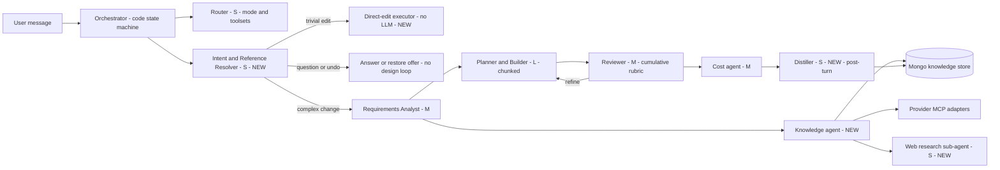

# Implementation Plan: Multi-Agent Generation with Conversation Memory, Knowledge Store & Model Tiering

**Branch**: `008-multi-agent-knowledge-pipeline` | **Date**: 2026-07-31 | **Spec**: [spec.md](./spec.md)

**Input**: Feature specification from `/specs/008-multi-agent-knowledge-pipeline/spec.md`

## Summary

Follow-up modification requests fail today because the assistant never sees the conversation: only the router receives history (last 4 user messages, 300 chars each, discarded after routing), while analyze, plan, and review receive just the newest message plus a text render of the canvas. This plan fixes that with a **conversation-context block**, a **cumulative requirement ledger**, and a new **intent & reference resolver** that maps "that lambda" to a concrete node and constrains the turn to that scope — with a deterministic fast path for trivial edits.

Layered on top: **role-based model tiering** (small models for classification/interpretation, the most capable model only for design) with proper `Retry-After` handling and token accounting to stop rate-limit failures; a **MongoDB knowledge store** of best-practice rules, patterns, and self-distilled lessons; and an optional **web-research agent** that fills gaps from official documentation and caches findings back into the store.

The existing pipeline already implements two Anthropic "Building effective agents" patterns correctly — orchestrator-workers (chunked planning) and evaluator-optimizer (reviewer with code-side hard gates). This plan does not replace them. The orchestrator stays a **code-level state machine**; new agents are added as steps within it, each doing one narrow job with the smallest model that suffices.

## Technical Context

**Language/Version**: TypeScript 5.x on Node.js (Next.js App Router, Node runtime route handlers)

**Primary Dependencies**: Next.js 16.2.10, React 19.2.4, Mongoose 9.7.3, `@modelcontextprotocol/sdk` 1.29.0, `@anthropic-ai/sdk` 0.110.0, `@xyflow/react` 12.11.1, `elkjs` 0.11.1. New: an HTTP search backend (Tavily or Brave) reached via `fetch` — no new SDK dependency.

**Storage**: MongoDB via Mongoose (sole system of record, 14 existing collections). This feature adds `KnowledgeEntry` and `LlmUsage`, and extends `LlmSettings` and `AIConversation`.

**Testing**: vitest (`npm test` → `vitest run`), flat suites in `app/tests/*.test.ts` (34 existing suites)

**Target Platform**: Node server (Next.js route handlers, `maxDuration = 120` on the chat turn); browser client for canvas and settings

**Project Type**: Web application — single Next.js app with server route handlers and a React client, not a split frontend/backend

**Performance Goals**: Generation turn 90s p90 / 120s hard cap (constitution, feature 004 envelope, unchanged by this feature). Trivial edits via the fast path complete in <5s (SC-003). At least 50% of model requests served by small/mid tiers (SC-004).

**Constraints**:
- Structured-output enforcement is unreliable on the configured providers (NVIDIA `guided_json` is documented in-repo as silently ignored for reasoning models), so every model output must pass a `sanitize*` coercion and must never trigger an unbounded retry loop (FR-036).
- Provider free tiers are tight and asymmetric: NVIDIA ~40 req/min, Gemini ~20 req/day, OpenRouter free pool 429/402-flaky, Groq retires models without notice. Default role chains must encode this.
- Existing turn budget (`ABORT_THRESHOLD_MS` 25s, `HARD_TIME_CAP_MS` 120s) applies across all new steps combined (FR-037).
- `app/AGENTS.md` warns this Next.js version has breaking changes vs. training data — read `app/node_modules/next/dist/docs/` before touching route or runtime code.

**Scale/Scope**: ~15 new/modified source files, 2 new collections, 5 user stories, 41 functional requirements. Knowledge store seeded with ~20 rules, expected to grow to low hundreds via distillation — well within keyword-scan range.

## Constitution Check

*GATE: Must pass before Phase 0 research. Re-checked after Phase 1 design.*

| Principle | Gate | Initial | Notes |
|---|---|---|---|
| **I. Official Integrations First** | Provider knowledge flows through official MCP servers; community dependency requires justification in this plan | ✅ PASS | Keeps official AWS Knowledge/Pricing MCP and MongoDB MCP as the primary rungs and *adds* the official `awslabs.aws-documentation-mcp-server`. Web search is consulted only after both store and official MCP miss. **Justification for a third-party dependency**: no cloud provider publishes a general web-search MCP or API, so no official option exists; the search backend is constrained to an official-documentation domain allowlist, keeping the *sources* official even though the *index* is third-party. |
| **II. Plugin-Based, Extensible Providers** | Adding a provider must not require editing core logic; core never hard-codes provider services | ✅ PASS *(after redesign)* | Provider-specific seed rules live in `app/src/lib/providers/<id>/rules.ts` and are collected through the existing registry — **not** in a core `knowledge/seed-rules.ts`. Only provider-agnostic rules (modification-turn, layout/readability) live in core. This was a CRITICAL finding in `/speckit-analyze`; the design below reflects the corrected placement (FR-038). |
| **III. API-First & Secure by Default** | No credentials to the browser; RBAC server-side; secrets encrypted; least privilege | ✅ PASS | Knowledge admin and usage endpoints are server-side under existing `settings:manage` RBAC. Search API keys stay server-side in env, never returned to the client — matching how MCP commands are handled today. Only derived capability keywords leave the system (FR-030), never raw user text. **Verified 2026-07-31**: `app/.env.local` is untracked, matched by `app/.gitignore` (`.env*` with an `!.env.example` exception), and no key material appears in any tracked file or in either repo's history — the earlier "committed secrets" concern was incorrect and is withdrawn. |
| **IV. Spec-Driven Delivery** | Approved spec and plan precede code | ⚠️ CONDITIONAL | spec.md is validated (16/16 checklist) but marked *pending approval*. No implementation may begin until it is approved. Note the artifacts were authored plan-first and reconciled afterwards; this is recorded rather than hidden. |
| **V. Verify Before Done** | `next build` passes; ESLint clean; flow driven and observed; outcomes reported faithfully | ✅ PASS | Test tasks are first-class in tasks.md; quickstart.md defines the observable end-to-end validation per story; non-regression re-runs of features 004/005/006 are explicit tasks. |
| **Cost realism constraint** | Every AI-planned or AI-edited config clamped to declared field bounds | ✅ PASS *(after fix)* | FR-039 extends clamping to the new direct-edit fast path, which was initially unstated. |
| **Diagram Generation Flow** | New architecture / major revision follows analyze → clarify → build → cost → finalize | ✅ PASS *(scoped)* | The fast path handles only small, unambiguous edits — explicitly **not** a new architecture or major revision, both of which continue through the full mandated sequence. Question and undo turns are not generation turns at all. Scoping is stated in the spec's Assumptions so the exemption is explicit rather than implied. |
| **Accessibility floor** | Responsive, visible keyboard focus, reduced-motion | ✅ PASS | New trace step kinds reuse the existing trace UI and its feature-004 a11y guarantees; new settings controls carry an explicit a11y verification task. |

**Result**: No unjustified violations. One conditional gate (IV) that must clear before implementation starts. No entries required in Complexity Tracking.

## Project Structure

### Documentation (this feature)

```text
specs/008-multi-agent-knowledge-pipeline/
├── plan.md              # This file
├── spec.md              # Feature specification (41 FR, 9 SC, 5 stories)
├── research.md          # Phase 0 output — technical decisions
├── data-model.md        # Phase 1 output — entities and schema changes
├── quickstart.md        # Phase 1 output — validation scenarios
├── contracts/           # Phase 1 output — interface contracts
│   ├── agent-interfaces.md
│   ├── settings-llm-usage.md
│   ├── settings-knowledge.md
│   └── chat-stream-events.md
├── checklists/
│   └── requirements.md  # Spec quality checklist (16/16 pass)
└── tasks.md             # Phase 2 output (/speckit-tasks)
```

### Source Code (repository root)

```text
app/src/lib/
├── generate/                        # the turn pipeline
│   ├── conversation-context.ts      # NEW — bounded transcript block
│   ├── intent.ts                    # NEW — EditScope resolver
│   ├── direct-edit.ts               # NEW — deterministic fast path
│   ├── agent-loop.ts                # MOD — cumulative rubric, scope enforcement, knowledge step
│   ├── orchestrator.ts              # MOD — conversation + scope + house-rules prompt blocks
│   ├── analyze.ts                   # MOD — context injection, role tagging
│   ├── reviewer.ts                  # MOD — cumulative grading, rules graded, advisory cross-check
│   ├── flow.ts                      # MOD — mergeBrief
│   ├── guidance-cache.ts            # MOD — generalized signature
│   ├── reference-patterns.ts        # MOD — store-backed with offline fallback
│   ├── router.ts                    # MOD — role tagging only
│   └── loop-config.ts               # MOD — pacing jitter
├── knowledge/                       # NEW — provider-agnostic knowledge layer
│   ├── store.ts                     # retrieval, hashing, dedupe, confidence lifecycle
│   ├── core-rules.ts                # provider-AGNOSTIC seed rules only
│   └── distill.ts                   # lesson extraction from review→refine pairs
├── research/                        # NEW
│   ├── web-search.ts                # pluggable backend + domain allowlist
│   └── knowledge-agent.ts           # store → MCP → web waterfall
├── providers/
│   ├── aws/rules.ts                 # NEW — AWS seed rules (constitution II)
│   ├── mongodb/rules.ts             # NEW — Atlas seed rules
│   ├── system/rules.ts              # NEW — HLD/LLD rules (from system/mcp.ts)
│   ├── registry.ts                  # MOD — expose per-provider rules
│   ├── mcp-registry.ts              # NEW — data-driven MCP server config
│   └── mcp-client.ts                # MOD — resolve through registry
├── models/
│   ├── KnowledgeEntry.ts            # NEW collection
│   ├── LlmUsage.ts                  # NEW collection
│   ├── LlmSettings.ts               # MOD — roleModels map
│   └── AIConversation.ts            # MOD — capability status on brief
├── llm.ts                           # MOD — role param, Retry-After, usage capture
├── llm-roles.ts                     # NEW — role → config chain resolver
└── llm-catalog.ts                   # MOD — tier/ctx/multimodal metadata

app/src/app/api/
├── projects/[id]/chat/messages/route.ts   # MOD — context assembly, intent branch, distill hook
└── settings/
    ├── llm/usage/route.ts           # NEW
    └── knowledge/route.ts           # NEW

app/scripts/seed-knowledge.mjs       # NEW — idempotent seeding + prune
app/tests/*.test.ts                  # NEW suites (flat, vitest)
```

**Structure Decision**: Single Next.js web application — server logic in route handlers under `app/src/app/api/`, shared domain logic in `app/src/lib/`, tests flat in `app/tests/`. No new top-level project. Two new `lib/` subdirectories (`knowledge/`, `research/`) mirror the existing `generate/` and `providers/` convention. Provider-specific knowledge deliberately lives under `providers/<id>/` rather than in the knowledge layer, to satisfy constitution Principle II.

---

## 1. Current-State Findings (verified against code)

### 1.1 Why follow-up / modification requests are misunderstood

| # | Root cause | Evidence |
|---|---|---|
| R1 | **Only the router ever sees conversation history** — last 4 *user* messages truncated to 300 chars, discarded after routing. `analyzeRequest`, `planOneChunk`, `reviewDraft`, and the cost stages receive **only the single latest message** plus a text render of the canvas. | `messages/route.ts:178`, `router.ts:107` |
| R2 | **Assistant replies and canvas-edit system messages never re-enter any prompt.** The `role==='user'` filter drops them; the "Direct canvas edit: …" system messages written expressly so "follow-ups build on the edited architecture" (`diff.ts:2-4`) are a dead channel — no call site reads them. | `messages/route.ts:178`, `architecture/route.ts:139-155` |
| R3 | **Each analyze turn overwrites `flow` wholesale**, discarding the prior brief's capabilities and selections. Requirements stated two turns ago vanish from the reviewer's rubric and can no longer fail a review. | `messages/route.ts:740-748`, `agent-loop.ts:418` |
| R4 | **No modification-intent stage.** Nothing resolves "the lambda" / "that queue" to concrete `nodeId`s or classifies the request kind. The planner gets only "PRESERVE USER WORK: edit only what the request requires" and must guess scope. | `orchestrator.ts:926-927`, `messages/route.ts:524-578` |
| R5 | **`diff.ts` output never feeds an LLM** — `editsApplied` is persisted and displayed but never used as context for the next turn. | `agent-loop.ts:326`, `diff.ts:29` |

### 1.2 Why rate limits get hit

- **One model does everything.** All 11 LLM call sites go through `llmJson()` with a single active provider+model (`llm.ts:524-563`); a 300-token routing call uses the same model as an 8K-token planning call.
- **429s trigger instant retry with zero delay**; `Retry-After` is never read (`llm.ts:341`). Provider exhaustion sets a blunt fixed 120s in-process cooldown (`llm.ts:99-104`).
- **No token or usage accounting** — `response.usage` is discarded (`llm.ts:385-387`, `llm.ts:240-246`). The only pacing is a hardcoded 1600ms sleep between chunk plans (`loop-config.ts:61-66`).
- The catalog has **no capability metadata** (no tier, context window, multimodal flag) to route on.

### 1.3 Existing knowledge reuse (build on, don't duplicate)

- `McpGuidanceCache` — keyed **only** by matched reference-pattern ids; a request matching no pattern is never cached (`guidance-cache.ts:15,21`).
- `reference-patterns.ts` — 10 hardcoded patterns, keyword-scored (threshold ≥2, top 2).
- `ServiceRegionAvailability` — 30-day cached AWS regional availability.
- `system/mcp.ts` — hardcoded C4/design-principles brief.
- MongoDB is already the sole datastore, so the knowledge store adds no infrastructure.

---

## 2. Target Architecture

Design principle (Anthropic, *Building effective agents*): **use the simplest composition that works** — deterministic code where a rule suffices, a small model where classification suffices, the largest model only where synthesis is genuinely hard. The orchestrator remains a code state machine; no LLM decides the workflow.

### 2.1 Agent roster



Tier legend: **S** small/fast, **M** mid, **L** most capable. Every agent emits trace steps through the existing emitter, preserving the feature-004 transparency guarantee.

| Agent | Status | Tier | Responsibility |
|---|---|---|---|
| Orchestrator | exists (`routeTurn`) | code | Turn state machine; gains the intent stage and context assembly |
| Router | exists | S | Mode/toolset classification — logic unchanged, cheaper model |
| **Intent & Reference Resolver** | **new** | S | Classify the follow-up and resolve noun phrases to `nodeId`s; emits `EditScope` |
| **Direct-edit executor** | **new** | none | Deterministic rename / remove / config change, then clamp, re-price, re-validate |
| Requirements Analyst | exists (`analyze.ts`) | M | Requirement extraction; now receives conversation context, merges into the cumulative ledger |
| **Knowledge agent** | **new** | code + S | Waterfall: store → provider MCP → web research; writes findings back |
| **Web research sub-agent** | **new** | S | Search official docs, fetch, summarize into a `KnowledgeEntry` |
| Planner/Builder | exists (`orchestrator.ts`) | **L** | Chunked drafting; now receives conversation context, edit scope, house rules |
| Reviewer | exists (`reviewer.ts`) | M | Grades the **cumulative** ledger and stored rules; hard code gates unchanged |
| Cost agent | exists | M | Unchanged flow, tiered model |
| **Distiller** | **new** | S | Post-turn: converts review-failure → refine-fix pairs into reusable lessons |

### 2.2 Fixing follow-up understanding (Phase 1 — highest value)

**A. Conversation context** — new `generate/conversation-context.ts`:

- `buildConversationContext(convo, arch)` renders a bounded (~1,500 char) block: `USER: …` / `ASSISTANT: applied <editsApplied>` / `CANVAS EDIT (manual): <diff summary>` — finally consuming `diff.ts` output (fixes R2, R5).
- Injected into `analyzeRequest`, `interpretResponse`, `planOneChunk`, and the intent resolver. **Not** into the reviewer: per FR-001 and the spec's closing assumption, self-review grades the cumulative requirement ledger (FR-002), not the transcript. Keeping the transcript out of the rubric prevents conversational phrasing from diluting objective grading.

**B. Cumulative requirement ledger** (fixes R3):

- `mergeBrief(prev, next)` unions capabilities and selections and marks superseded entries, replacing the wholesale `flow` overwrite. So "add WAF" in turn 3 cannot silently drop "multi-region DR" from turn 1.
- Per-capability `status: 'met' | 'pending' | 'withdrawn'` on the brief drives cumulative coverage in the trace.

**C. Intent & Reference Resolver** (fixes R4) — new `generate/intent.ts`:

```
resolveIntent({ text, context, nodes, edges, containers }) -> EditScope
EditScope = {
  kind: 'new' | 'add' | 'remove' | 'reconfigure' | 'rename' | 'restyle'
        | 'undo' | 'question' | 'ambiguous',
  targets:   [{ nodeId, confidence }],
  additions: [{ serviceHint, nearNodeId }],
  freeform:  string
}
```

One small-model call (~400 max tokens) with the same sanitize-everything discipline as `sanitizeRoute`. `routeTurn` consults it when the canvas is non-empty and no interaction round is open:

- `question` → answer-only turn, no canvas mutation (today these can mangle the diagram);
- `undo` → **offer** the matching earlier version and restore only on explicit confirmation (FR-008) — a restore discards current work, so it is never automatic;
- `rename` / `remove` / single-field `reconfigure` with high-confidence targets → **direct-edit executor**: apply, clamp to field bounds (FR-039), re-price, re-validate. No plan loop, no large-model call;
- `ambiguous` → one clarify round through the existing interaction machinery;
- everything else → the normal analyze/build path, with `EditScope.targets` passed to the planner as a hard scope constraint and enforced code-side after the plan lands (reusing the preserve-user-work rejection at `agent-loop.ts:502-515`).

**Scope note (constitution)**: the fast path handles small, unambiguous edits only. A new architecture or major revision continues through the full analyze → clarify → build → cost → finalize sequence.

### 2.3 Model tiering & rate-limit resilience (Phase 2)

**A. Catalog metadata** — extend model entries in `llm-catalog.ts` with `tier: 'small' | 'mid' | 'large'`, `ctx`, `multimodal`.

**B. Role-based resolution** — new `llm-roles.ts`:

| Role | Call sites | Tier | Default chain |
|---|---|---|---|
| `route` | router.ts | S | groq `llama-3.1-8b-instant` → nvidia active |
| `intent` | intent.ts | S | same as route |
| `interpret` | analyze.ts (interpretResponse) | S | same |
| `distill` | knowledge/distill.ts | S | same |
| `research` | research/knowledge-agent.ts | S | groq 8b → gemini `gemini-2.5-flash` |
| `analyze` | analyze.ts | M | nvidia nemotron-49b → groq `llama-3.3-70b-versatile` |
| `review` | reviewer.ts | M | as analyze |
| `cost` | cost-options.ts, cost-orchestrator.ts | M | as analyze |
| `report` | report.ts | M | as analyze |
| `plan` | orchestrator.ts | **L** | active configured model → other keyed providers |

- `llmJson(input & { role?: LlmRole })` — **omitting `role` preserves today's behavior exactly**, so migration is incremental and each call site can move independently.
- Overrides persist on the existing `LlmSettings` singleton (`roleModels`). Free-tier realities are encoded in the default ordering: Gemini (~20 req/day) never early, OpenRouter free pool last, Groq 404s already skip.
- Expected effect: everything except plan and review leaves the largest model — roughly a 40–60% cut in large-model requests per turn, directly attacking the NVIDIA 40 req/min ceiling that `CHUNK_PLAN_DELAY_MS` currently works around.

**C. 429 discipline** in `llm.ts`: parse `Retry-After` (seconds or HTTP-date); if ≤8s and the turn budget allows, wait exactly that and retry the same provider once, else hop to the next chain entry. Cooldown duration comes from the header when present, else today's 120s. Add ±20% jitter to chunk pacing.

**D. Usage accounting**: stop discarding `response.usage`. New `LlmUsage` collection, fire-and-forget insert (same best-effort pattern as `guidance-cache.ts`). A `recentRequests(provider, 60s)` sliding window lets the chain resolver skip a provider already near its per-minute budget *before* burning a 429.

**E. Quality baseline (FR-041 / SC-009)**: before any role migration is enabled, record convergence rate and iterations-to-pass over a fixed request set. Once tiering ships this measurement is unrecoverable, so it is scheduled in Phase 0 setup — not alongside the tiering work.

### 2.4 MongoDB knowledge store (Phase 3)

**A. `KnowledgeEntry` collection** — full schema in [data-model.md](./data-model.md). Carries `kind`, `provider`, `designMode`, `title`, `content` (≤600 chars), `keywords`, `source`, `sourceUrl`, `confidence`, usage counters, `staleAfter`, and a unique content `hash`.

**B. Retrieval** — `knowledge/store.ts`: keyword scoring (the approach already proven by `matchReferencePatterns`) filtered by provider and design mode, top-K (default 6), char-capped. Injected into the planner as `HOUSE RULES & LESSONS:` **and** into the reviewer so rules are graded, not merely suggested. Misses cost one indexed query and no LLM call. Vector/Atlas Search retrieval is a deliberate non-goal — keyword scoring is debuggable and free; revisit only if hit-rate proves poor.

**C. Rule placement (constitution Principle II)** — provider-specific rules live with their provider, collected through the registry:

- `providers/aws/rules.ts` — AWS structural rules
- `providers/mongodb/rules.ts` — Atlas rules
- `providers/system/rules.ts` — HLD/LLD rules (migrated out of `system/mcp.ts`)
- `knowledge/core-rules.ts` — provider-agnostic rules only (modification-turn, layout/readability)

Adding Azure later means adding `providers/azure/rules.ts` and a registry entry — **no core edit**. The seeding script walks the registry, so provider rules and provider catalogs stay in one place.

**D. Migration of existing hardcoded knowledge**: the 10 reference patterns become `kind: 'pattern'` entries (matcher reads the store, hardcoded array remains an offline fallback); `system/mcp.ts` design principles become `system` provider rules. `McpGuidanceCache` keying generalizes to matched-pattern-ids **or** top capability keywords, so pattern-less requests become cacheable (fixes the `patternIds.length === 0` no-op).

**E. Learned-lessons loop** (the "repetitive information resolved easily" requirement): after a converged turn where iteration 1 failed review and a refinement fixed it, the Distiller converts the (gap → fix) pair into a candidate rule — e.g. *"When the request mentions real-time notifications, include a push/streaming path — reviewers repeatedly flag its absence."* Runs post-turn, off the critical path, after the result is persisted. Deduped by content hash; confidence starts 0.6, +0.05 per passing turn in which it was injected; entries unused 60 days or stuck below 0.5 are pruned. The distiller prompt forbids project names, user-text literals, and IDs (FR-021).

**F. Initial seed rules** (~20, `source: 'seed'`) — full text in [data-model.md](./data-model.md), summarized:

*AWS (`providers/aws/rules.ts`)*: edge service in front of public workloads; databases/caches in private subnets; `cloud > region > vpc > az > subnet` containment with serverless at region level; HA ⇒ ≥2 AZs behind a balancer; DR/multi-region ⇒ second region with replication and failover; auth service for account-bearing apps; observability when "production-ready"; WAF + KMS for security/compliance; every compute node edged to its datastore; VPC endpoints under strict private networking.

*Atlas (`providers/mongodb/rules.ts`)*: clusters inside a project container, private endpoint/peering when a VPC exists; vector search via `atlas-vector` alongside the cluster.

*System/HLD/LLD (`providers/system/rules.ts`)*: HLD (C4 L1–L2) uses system boundaries and tiers with no vendor services; LLD (C4 L3) uses components/packages grouped by module boundary.

*Core, provider-agnostic (`knowledge/core-rules.ts`)*: no empty containers; left→right reading order with verb-labelled edges; queue/stream between producer and consumer for async requirements; every node has ≥1 edge unless standalone; modification turns change only referenced nodes; ambiguous references resolve to the most recently discussed match or ask; "undo" means restore, not redesign.

### 2.5 Web research agent (Phase 4)

- `research/web-search.ts` exposes one interface — `search(query, {allowDomains})` and `fetchPage(url)` — behind a backend chain: **Tavily** (`TAVILY_API_KEY`) → **Brave** (`BRAVE_API_KEY`) → disabled. No key means the rung is silently skipped, mirroring how MCP env vars already degrade to indicative mode.
- Invoked **only** by the knowledge agent when store and MCP both miss or are stale, at most once per turn. Domain allowlist: `docs.aws.amazon.com`, `aws.amazon.com`, `mongodb.com/docs`, `learn.microsoft.com` (constitution Principle I).
- Path: fetch top 1–2 pages → small-model summarize (~500 chars) → store as `source:'web'` with `sourceUrl` and `staleAfter: +14d` → inject this turn. Once the horizon passes the finding is re-verified from source rather than reused (FR-026). **The store is the cache** — the next equivalent request performs no lookup.
- Trace shows the search as a step, preserving feature-004 transparency.

### 2.6 Open-source MCP strategy (Phase 4)

The canvas is the app's own JSON model, so external MCPs serve as **knowledge and validation** sources, never as the renderer.

- Keep the official AWS Knowledge, AWS Pricing, and MongoDB MCPs.
- Add `awslabs.aws-documentation-mcp-server` as a fallback knowledge rung, and optionally `awslabs.aws-diagram-mcp-server` behind a flag as an **advisory** topology cross-check surfaced to the reviewer only — never authoritative, never shown to the user as truth (FR-040).
- Make the server list data-driven via `providers/mcp-registry.ts`: `{ id, command, tools[], provider, purpose, enabled }`. `mcp-client.ts` already pools by command string, so this is a thin registry on top — mirroring the provider plugin registry philosophy.

---

## 3. Phased Delivery

Phases are independently shippable, ordered by user value per unit of effort. **Phases 1 and 2 are the core ask.**

### Phase 0 — Prerequisites (before any behavior change)
1. Verify local secret hygiene before Phase 4 adds search-service keys: `app/.env.local` untracked, ignore rules effective, no key material in tracked files or history. **Verified clean 2026-07-31 — no rotation required.**
2. Record the design-quality baseline — convergence rate and iterations-to-pass over a fixed request set (FR-041 / SC-009). Unrecoverable once tiering lands.
3. Capture the current `npm test` / `npm run build` state.

### Phase 1 — Follow-up understanding (fixes the reported defect)
1. `conversation-context.ts`, injected into analyze / interpret / plan (R1, R2, R5).
2. `mergeBrief` cumulative ledger; reviewer grades the merged rubric (R3).
3. `intent.ts` + `EditScope`, wired into `routeTurn` (R4).
4. Direct-edit executor with clamping, re-pricing, re-validation; code-side scope enforcement.
5. Modification evaluation fixture set and runner (SC-001, SC-006).

### Phase 2 — Model tiering & rate-limit resilience
1. Catalog metadata; `llm-roles.ts` chain resolver; optional `role` on `llmJson`.
2. Migrate call sites — `route` and `interpret` first (lowest risk), then `analyze`/`review`/`cost`/`report`, `plan` last.
3. `Retry-After` parsing, bounded same-provider wait, header-derived cooldown, jittered pacing.
4. `LlmUsage` capture + sliding-window provider budget check.
5. `LlmSettings.roleModels` overrides (API only; UI in Phase 5).

### Phase 3 — Knowledge store
1. `KnowledgeEntry` model + `knowledge/store.ts` + planner and reviewer prompt blocks.
2. Per-provider rule modules + registry collection + seeding script.
3. Migrate reference patterns and system design principles; generalize the guidance-cache signature.
4. Distiller post-turn hook + dedupe/confidence/pruning lifecycle.

### Phase 4 — Web research + MCP registry
1. `web-search.ts` (Tavily/Brave, allowlist) + knowledge-agent waterfall + trace steps + staleness re-verification.
2. MCP registry; AWS documentation MCP fallback; optional advisory diagram cross-check.

### Phase 5 — Surface & observability
1. Settings: per-role model mapping; real usage panel replacing the mocked figures.
2. Knowledge admin (list/edit/disable/delete) under `settings:manage`.
3. Extend the evaluation harness deferred from feature 004.

### Success-criteria traceability

| Spec criterion | Delivered by | Verified by |
|---|---|---|
| SC-001 scoped modifications ≥90% | Phase 1 | Modification eval runner |
| SC-002 cross-turn requirement enforcement | Phase 1 | Brief-merge suite + quickstart US1 |
| SC-003 trivial edits <5s, no large-model call | Phase 1 | Fast-path timing assertion + usage records |
| SC-004 ≥50% small/mid, quality ≥ baseline | Phase 2 | Usage aggregation vs. Phase 0 baseline |
| SC-005 zero 429 turn failures in burst | Phase 2 | Burst test |
| SC-006 ambiguity asks ≥90% | Phase 1 | Modification eval runner |
| SC-007 knowledge reuse, no repeat web lookup | Phases 3–4 | Waterfall test + trace inspection |
| SC-008 no 004/005/006 regression | All | Re-run of prior quickstarts |
| SC-009 baseline recorded pre-tiering | Phase 0 | Baseline artifact exists before Phase 2 |

---

## 4. Constraints, Risks, Mitigations

- **Small-model JSON reliability**: NVIDIA `guided_json` is documented in-repo as unreliable for reasoning models, and small models will be worse. Every new agent output goes through the established `sanitize*` discipline; strict `response_format` only where the provider supports it; intent and router failures degrade to today's behavior. Never loop on non-compliant output.
- **Free-tier asymmetry**: Gemini ~20 req/day, OpenRouter free pool flaky, Groq retires models. Encoded in default chain ordering; chains are data, tunable in settings.
- **Latency**: intent adds one small call (~1–2s) to modification turns but removes the entire plan loop for trivial edits — net win. Existing abort threshold and hard cap are unchanged; the distiller runs after the result is persisted.
- **Cross-story file contention**: `orchestrator.ts`, `messages/route.ts`, and `reviewer.ts` are each touched by three or more phases. Sequence the phases rather than parallelizing them across developers, or assign file ownership explicitly.
- **Non-regression**: features 004/005/006 acceptance scenarios must pass unchanged; existing `llm-config.test.ts` and `llm-extract.test.ts` gate the `llm.ts` changes.
- **Custom Next.js**: read `app/node_modules/next/dist/docs/` before touching route or runtime code.
- **Privacy**: lessons carry no project-identifying content (distiller constraint + Phase 5 admin review); only derived capability keywords reach external search services.
- **Local secrets**: `app/.env.local` holds real keys but is untracked and correctly ignored (verified 2026-07-31 — never committed to either repo). Phase 4 adds two more keys to the same file; the `!.env.example` exception in `app/.gitignore` must keep excluding real values.

## Complexity Tracking

No constitution violations require justification. The one conditional gate (Principle IV — spec approval pending) is a process step, not a design compromise, and no entry is needed here.

## Post-Design Constitution Re-check

Re-evaluated after Phase 0 and Phase 1 artifact generation ([research.md](./research.md), [data-model.md](./data-model.md), [contracts/](./contracts/), [quickstart.md](./quickstart.md)):

| Principle | Post-design | Change from initial |
|---|---|---|
| I. Official Integrations First | ✅ PASS | Research confirmed no official general web-search integration exists; the domain allowlist and store-then-MCP-then-web ordering are contract-level, not conventions |
| II. Plugin-Based Providers | ✅ PASS | data-model.md defines rule collection through the registry; no core file enumerates a provider's services |
| III. API-First & Secure | ✅ PASS | contracts/ confirm all new endpoints are server-side under `settings:manage`; no key material crosses the wire |
| IV. Spec-Driven Delivery | ⚠️ CONDITIONAL | Unchanged — spec approval still required before implementation |
| V. Verify Before Done | ✅ PASS | quickstart.md defines observable end-to-end validation per story plus the non-regression set |
| Cost realism | ✅ PASS | Clamping is now a contract obligation on the direct-edit path |
| Diagram Generation Flow | ✅ PASS | Fast-path scoping documented in spec assumptions and contracts |
| Accessibility floor | ✅ PASS | No new UI surface bypasses the existing trace/settings a11y patterns |

**Result**: design introduces no new violations; the single conditional gate is unchanged and blocks implementation only.
